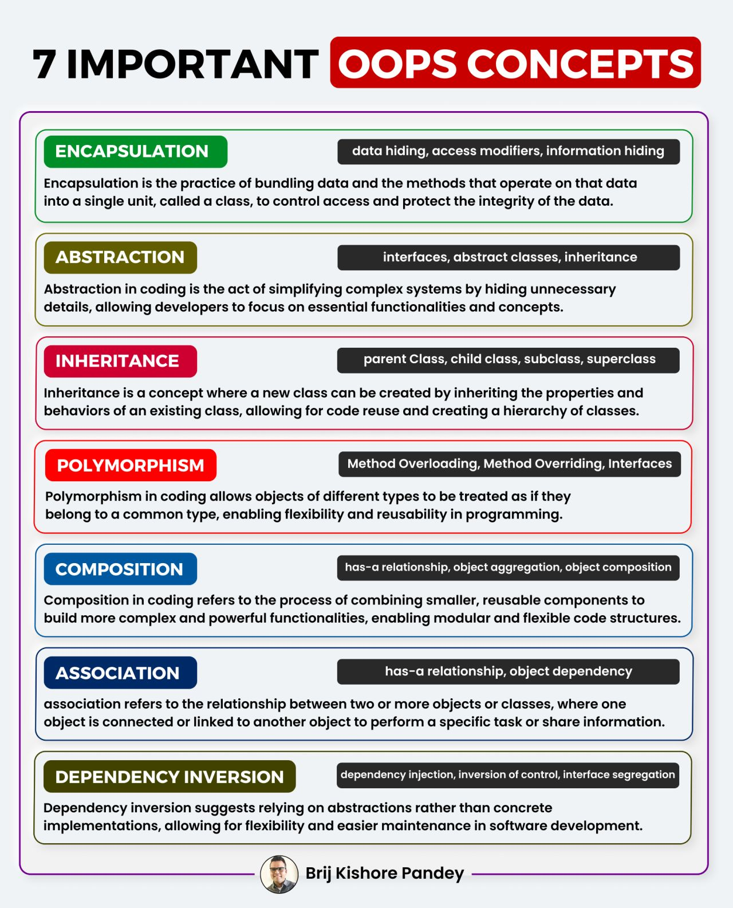

OOP ==> Herencia
---
[CLASE 30](https://drive.google.com/file/d/1XLl-wXV7c0I1CmBBF9zuOM3cO6uKX3ne/view?usp=sharing)

Que propiedades tienen los objetos. Conceptos básicos e importantes en OOPs

- [Encapsulamiento](https://www.fundamentosprogramacion.site/2023/01/que-es-la-encapsulacion-en-programacion.html)
- [Abstraccion](https://pythondiario.com/2018/08/clases-abstractas-ejemplos-practicos.html) | [ABS](https://towardsdatascience.com/how-to-use-abstract-classes-in-python-d4d2ddc02e90)

- [Herencia](https://www.programacionfacil.org/cursos/python_poo/python_poo_7_herencia_de_clases_como_utilizar_super.html)
- [Polimorfismo](
    https://ellibrodepython.com/polimorfismo-en-programacion
)

---
* Metodos de acceso
 
- [POLIMORFISMO](https://pythones.net/polimorfismo-sobrecarga-metodos/)

* Que es la herencia simple y herencia multiple?
    - [HERENCIA SIMPLE Y MULTIPLE](https://unipython.com/herencia-multiple-de-clases-en-python/)
    
* Que es la colaboracione entre clases?

Relaciones estructurales
--- 

- [DATA EXTRA](https://www.seas.es/blog/informatica/agregacion-vs-composicion-en-diagramas-de-clases-uml/)

- [ESTRUCTURAS](https://www.edrawsoft.com/es/article/uml-aggregation-vs-composition.html)
- Composición ? -> Como componer una clase => persona necesita brazos y piernas
- Agregacion ? --> Una persona necesita tener pantalon? No pero se los decoras
- Asociación ? --> La persona, necesita necesariamente tarjetas de credito o un auto?, no pero se les puede asociar.
    

Bibliofia extra:
> [OOPS](https://picodotdev.github.io/blog-bitix/2021/03/los-conceptos-de-encapsulacion-herencia-polimorfismo-y-composicion-de-la-programacion-orientada-a-objetos/)

> [DEPENDECY INJECTION](https://pywombat.com/articles/dependency-injection-python)

> [BUENAS PRACTICAS RECOMENDADAS](https://gimscop.github.io/good_programming_practices/lecture.slides.html#/)